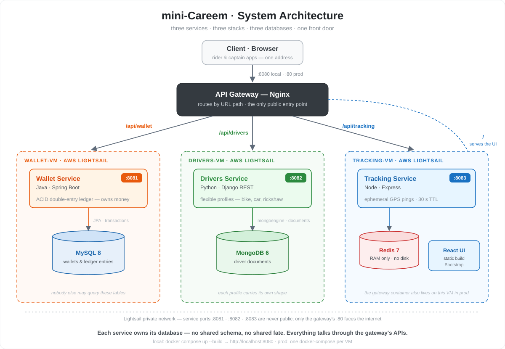

# mini-Careem

A microservices teaching project: a tiny ride-hailing app built as **three
services on three different stacks with three different databases**, behind one
Nginx gateway, deployable as Docker containers on AWS Lightsail.

- **Wallet** — Java · Spring Boot · MySQL — money, ACID, double-entry ledger
- **Drivers** — Python · Django · MongoDB — flexible document profiles
- **Tracking** — JavaScript · Node + React · Redis — ephemeral live GPS



**Start here → [GUIDE.md](./GUIDE.md)** for the architecture, the run-it-locally
command, testing, and the AWS Lightsail deployment steps. Each service also has
its own README explaining why its stack is the right one.

Quick start (needs Docker):

```bash
docker compose up --build
# open http://localhost:8080
```
